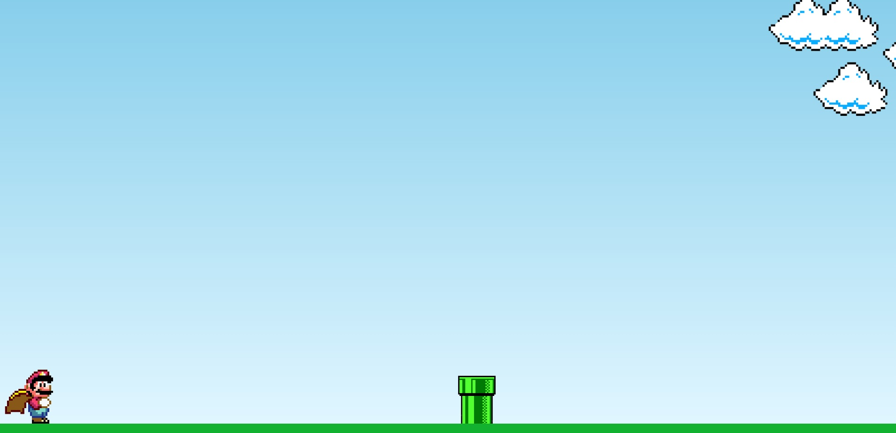
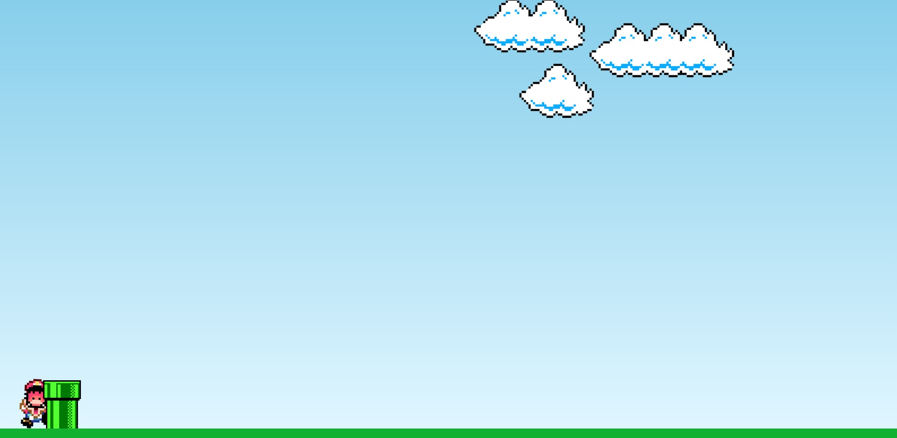

<h1 align="center">Projeto Jogo Mario</h1>  

Projeto para criação de uma mini versão do jogo do Mário. 
O objetivo é continuar treinando e aprofundando os conhecimentos em HTML5, CSS3 e JavaScript.

<h2 align="center">Aprendizados nesse projeto 🎯</h2>
Com esse projeto aprendi sobre o método getComputedStyle() e a criar animação no CSS com @keyframes. 

<h2 align="center">Tecnologias utilizadas 🛠</h2> 

<h2 align="center">Deploy 👨🏽‍💻</h2>
<a href="https://lilian-rangel-jogo-mario.netlify.app/" target="_blank">Confira o jogo nesse link</a>

<h2 align="center">Como utilizar o jogo</h2>
<ul>
<li>O jogo vai iniciar automaticamente.</li>
<li>Para pular o obstáculo basta pressionar qualquer tecla.</li>
</ul>
<ul>
<li>Para jogar novamente basta atualizar a página.</li>
</ul>

<h2 align="center">Prints da página</h2>
 

<h2 align="center">Demonstração do jogo</h2>

<h2 align="center"> Contributor 💻</h2>
<table align="center">
<tbody>
<tr>
<td align="center">
<a href="https://github.com/lilian-rangel" rel="nofollow"> <b>Lilian Rangel</b></a>
</td>
</tr>
</tbody>
</table>
